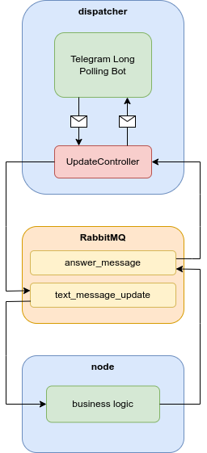

# TaskTrackifyBot

> TaskTrackifyBot - это телеграм-бот, предназначенный
> для планирования задач и повышения продуктивности.
> Он обеспечивает удобный способ записи, просмотра
> и удаления задач, помогая вам организовать свою работу.

## Оглавление

- [Архитектура проекта](#архитектура-проекта)
- [Инструкция по установке](#инструкция-по-установке)
- [Функционал](#функционал)

## Архитектура проекта



<p align="right">
    <a href="#Оглавление">назад</a>
</p>

## Инструкция по установке

- [Требования](#требования)
- [Установка](#установка)
- [Запуск](#запуск)

<p align="right">
    <a href="#оглавление">назад</a>
</p>

### Требования

- Git
- Docker
- JDK 11
- Apache Maven

<p align="right">
    <a href="#инструкция-по-установке">назад</a>
</p>

### Установка

1. Склонируйте проект с помощью команды:
```bash
git clone https://github.com/BucketOnHead/java-task-tracker-telegram-bot
```

2. Заполните файл `.env.example` и переименуйте его в `.env`:

```dotenv
TELEGRAM_BOT_USERNAME=YourBotUsername
TELEGRAM_BOT_TOKEN=YourBotToken
# and others
```

3. Перейдите в директорию проекта:
```bash
cd java-task-tracker-telegram-bot
```

4. Соберите проект с помощью Apache Maven:
```bash
mvn clean install
```

<p align="right">
    <a href="#инструкция-по-установке">назад</a>
</p>

### Запуск
После установки проекта, вы можете запустить его с помощью команды:
```bash
docker-compose up -d
```

<p align="right">
    <a href="#инструкция-по-установке">назад</a>
</p>

## Функционал

> ⚠ Внимание! Раздел может быть устаревшим!

| Команда     | Функция                             |
|:------------|:------------------------------------|
| `/start`    | Запуск бота                         |
| `/delete`   | Удаление аккаунта                   |
| `/help`     | Получение списка доступных команд   |
| `/profile`  | Получить информацию о профиле       |
| `/taskmode` | Переход в режим управления задачами |
| `/main`     | Переход в главный режим             |
| `/task`     | Создание задачи                     |
| `/tasks`    | Получение списка задач              |
| `/donetask` | Удаление задачи из списка           |

<p align="right">
    <a href="#оглавление">назад</a>
</p>